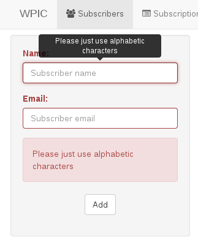

Very simple and fast regex based form validator for Bootstap3. Also, you can use it without boostrap. It work perfect with Chrome, Firefox IE7+, and mobile browsers.

# How to use (with bootstrap)

###CSS
	<link rel="stylesheet" href="http://netdna.bootstrapcdn.com/bootstrap/3.0.3/css/bootstrap.min.css">
	

###HTML
	<form method="POST" action="some_url_to_post_there">
		<fieldset>
			

				<label class="control-label">Sample:</label>
				<input name="name" class="form-control" placeholder="Sample item" data-title="Sample message" data-require="" data-regex="^[a-zA-Z]{1,30}$" />
			

			

				<label class="control-label">Email:</label>
				<input name="name" class="form-control" placeholder="Your email" data-title="Please use valid email address" data-require="" data-regex="email" />
			

			

				<label class="control-label">Select</label>
				<select class="form-control" data-require="" name="select">
					<option value="">Select one item please</option>
					<option value="value1">Item1</option>
					<option value="value2">Item2</option>
				</select>
			

			

				

					<label class="control-label">
						<input data-require="" name="accept" type="checkbox" value="true"> Accept?
					</label>
				

			

			

				

					Please wait...
				

			

			

			

			

				Sent!
			

			

				<button class="btn btn-default" type="submit">Submit</button>
			

		</fieldset>
	</form>

###script
	
	
	
	

----
# Use it without bootstrap

###HTML
	<input
		name="name"
		type="text"

		data-title="This is a message show after validation failed"
		data-regex="REGEX"
		data-require=""
		data-equals="name_of_the_second_field"
	/>

###Javascript
	$(selector).validate({
		init: function() {

		},
		success: function() {

		},
		fail: function(invalids) {

		}
	})

**data-title:**

Error description. With $(invalids[i]).attr('data-title') you can get it. For bootstrap3Validate just put it there you don't need to do anything

**data-regex:**

Validation regex. You can also put 'email' and 'tel'. Examples:

^[a-z]{1,10}$

Means all a-z and length should be 1~10

^[0-9]{2}$

Means just numbers between 10~99

You can find thousand of sample regex by Goolging.

**data-require:**

required or not

**data-equals:**

To check value of 2 field are same or not. Just add it to first one.